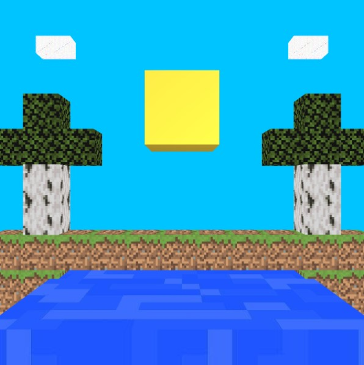

# Raytracer
Objetivo:

Que los estudiantes pongan en práctica todos los conocimientos adquiridos sobre raytracing

 

Requerimientos:

Deben escoger una escena, un paisaje o una foto de la naturaleza que les guste. Traten de replicar esta fotografía utilizando solo figuras geométricas simples y utilizando raytracing.

